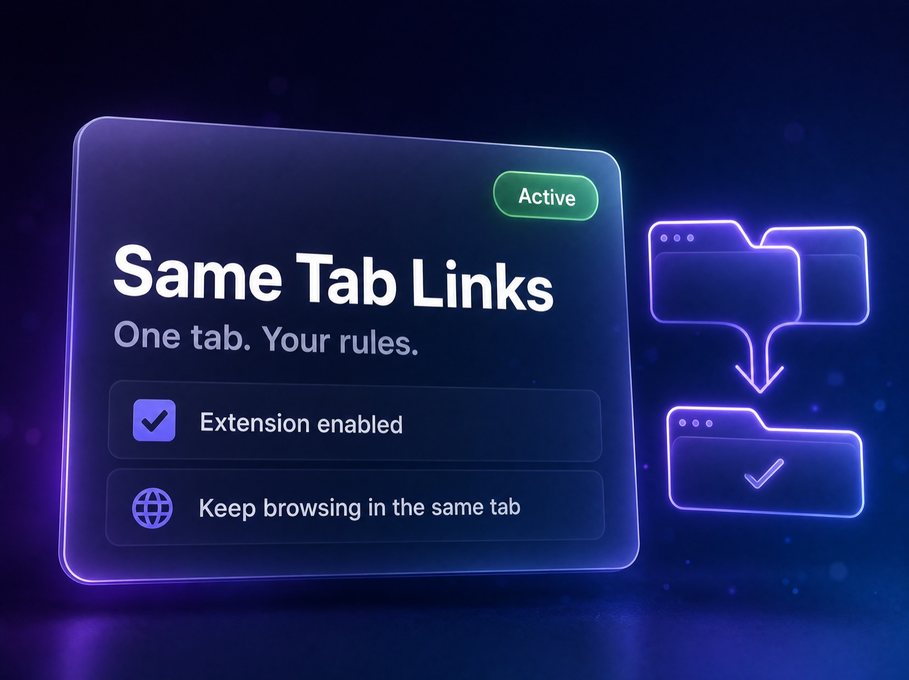
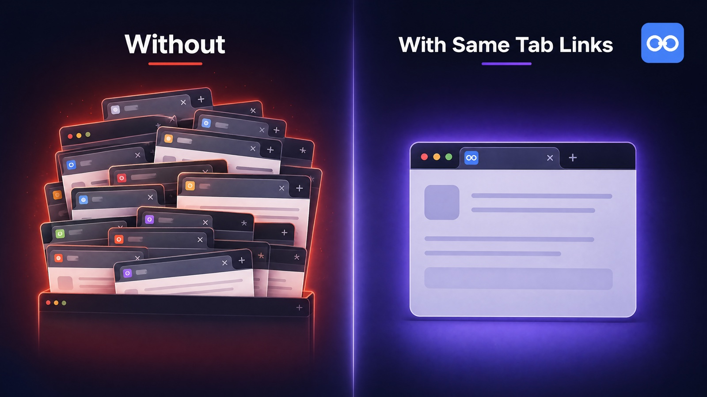
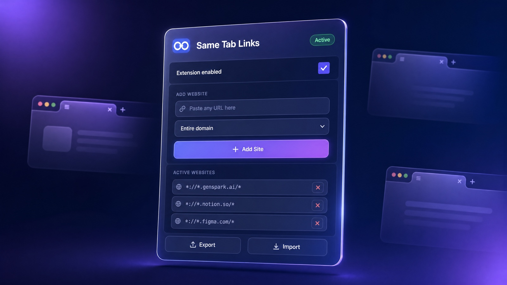
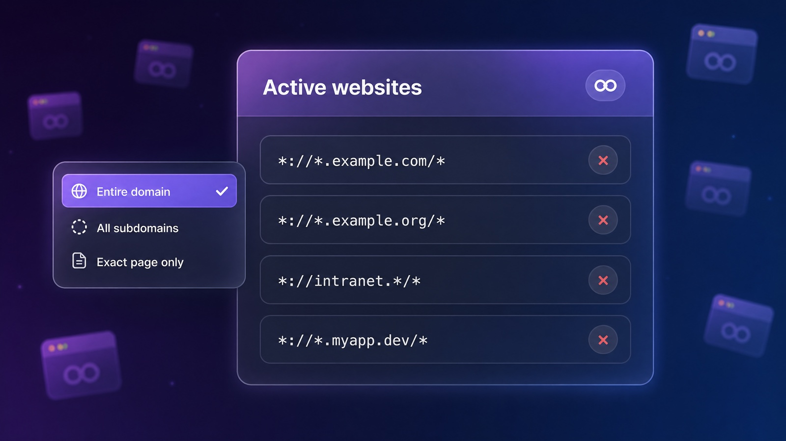
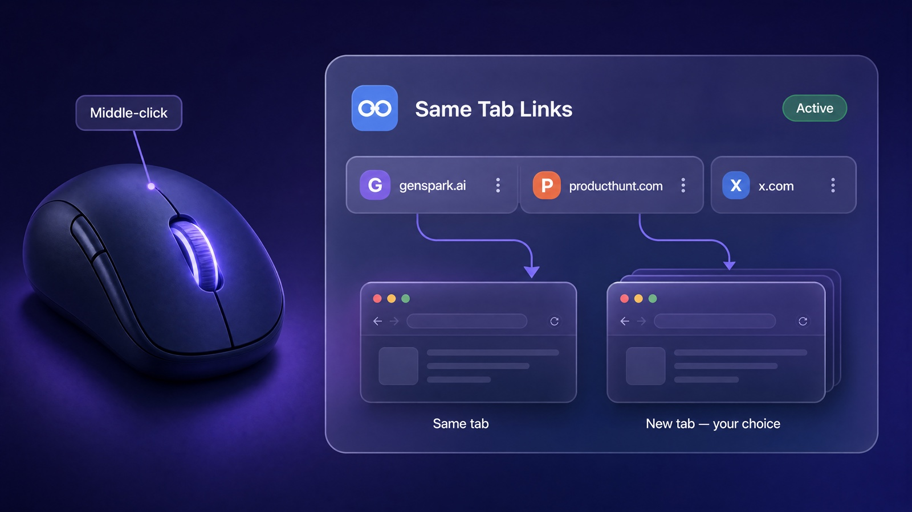
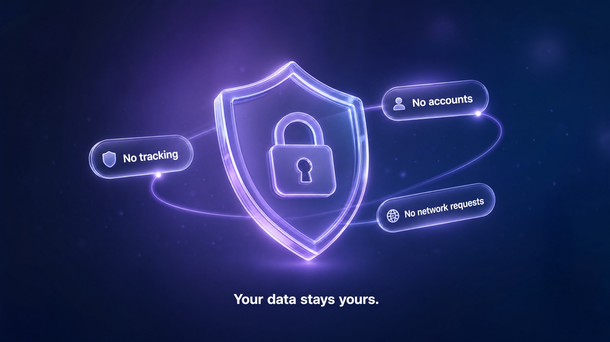

<p align="center">
  
</p>

<h1 align="center">Same Tab Links</h1>

<p align="center">
  <strong>Force links on the websites <em>you</em> choose to open in the same tab.</strong><br>
  Middle-click and <kbd>Ctrl</kbd>/<kbd>Cmd</kbd>+click still open new tabs — so you stay in control.
</p>

<p align="center">
  <a href="manifest.json"></a>
  <a href="PRIVACY_POLICY.md"></a>
  <a href="#install"></a>
</p>

---

## The problem

Some websites open every link in a brand-new tab. After ten minutes you have thirty tabs, your machine is breathing through a straw, and you've lost track of where you started.

You don't actually want a "kill new tabs everywhere" extension — that breaks too many sites. You want surgical control: turn it off **only on the few sites that abuse it**, and leave everything else alone.

That's all this does.

<p align="center">
  
</p>

---

## How it works

1. Click the extension icon.
2. Paste any URL.
3. Pick a scope — entire domain, all subdomains, or one exact page.
4. Hit **Add Site**.

From that point on, every "open in new tab" link on that site opens in the **current** tab instead. On every other site, the extension is invisible.

<p align="center">
  
</p>

---

## Features

### Per-site control with three scopes

Add the whole domain, every subdomain, or lock it down to a single URL. Your call, per site.

<p align="center">
  
</p>

### Middle-click stays sacred

The whole point of new-tab control is **you** deciding when a new tab opens. Middle-click and <kbd>Ctrl</kbd>/<kbd>Cmd</kbd>+click are explicitly preserved — the extension never interferes with them.

<p align="center">
  
</p>

### One-flick on/off

A master toggle in the popup turns the extension off without losing your site list. Flip it back on whenever.

### Export / import your list

Plain JSON. Move your config between machines, back it up, share it with a teammate.

---

## Privacy

Same Tab Links makes **zero network requests** and collects **zero data**. There is no remote server, no analytics, no telemetry.

The only thing it stores is your site list and your on/off toggle, kept in `chrome.storage.sync` — Chrome's built-in settings sync. That data never leaves Google's sync infrastructure and is never visible to me.

Full policy: [`PRIVACY_POLICY.md`](PRIVACY_POLICY.md).

<p align="center">
  
</p>

---

## Install

### From the Chrome Web Store

> _Listing pending review — link will go here once published._

### Manual (developer mode)

1. Download or clone this repo.
2. Open `chrome://extensions/`.
3. Enable **Developer mode** (top right).
4. Click **Load unpacked** and select this folder.
5. Click the puzzle-piece icon in your toolbar and pin **Same Tab Links** so the popup is one click away.

---

## How it does what it does

For the curious. The extension only activates the link-rewriting machinery on URLs in your saved list — every other page sees nothing.

When a site **is** in your list, the content script applies five layers of interception:

1. **`window.open` override** — injected into the page's main world so JS-driven popups (React Router, etc.) get rewritten too.
2. **`setAttribute('target', …)` override** — catches links that get their target set programmatically.
3. **`mousedown` / `auxclick` / `click` capture-phase listeners** — strip `target="_blank"` before the navigation happens. Middle-click events (`button === 1`) are explicitly skipped at every layer.
4. **`MutationObserver` (debounced)** — handles SPAs that inject new `<a target="_blank">` nodes after page load.
5. **Periodic backup scan** — picks up anything the observer somehow missed.

The whole script bails out in the first millisecond on any URL that isn't in your list, so the cost on every other site is effectively zero.

---

## Project layout

```
manifest.json          Chrome MV3 manifest
background.js          Service worker — seeds defaults on first install
content.js             Content script — wires up the five interception layers
injected.js            Page-world script — overrides window.open
popup.html / .css / .js   The popup UI
utils/storage.js       chrome.storage.sync wrapper + URL pattern matching
utils/interceptor.js   Link inspection + target stripping helpers
icon16/48/128.png      Toolbar icons
docs/                  Marketing/README images
PRIVACY_POLICY.md      Privacy policy (must be hosted publicly for Web Store)
STORE_LISTING.md       Copy-paste fields for the Chrome Web Store dashboard
SUBMISSION_GUIDE.md    Step-by-step Web Store submission walkthrough
```

---

## Building the upload zip

```bash
zip -r same-tab-links-v1.0.0.zip \
  manifest.json background.js content.js injected.js \
  popup.html popup.css popup.js \
  utils icon16.png icon48.png icon128.png
```

The `docs/`, `*.md`, and `README.txt` files are intentionally excluded — they're for humans, not the store.

---

## Contributing

Bug reports and small PRs are welcome. Please don't open PRs that broaden host permissions, add network requests, or add tracking — those are non-negotiable for this project.

---

## License

MIT. See `LICENSE` if present, otherwise treat the source as MIT-licensed unless stated otherwise.
